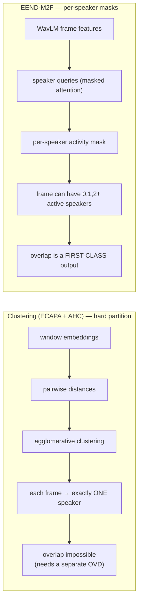
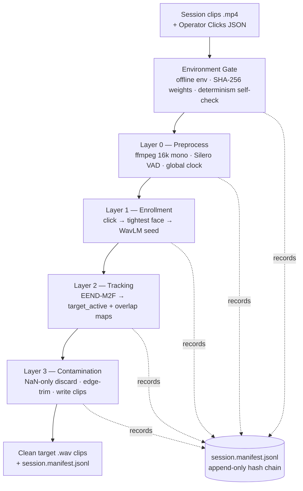
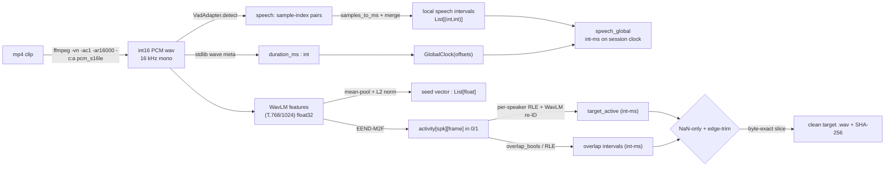
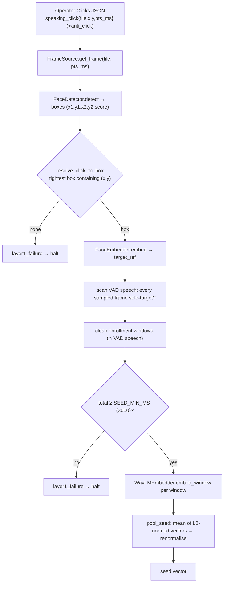
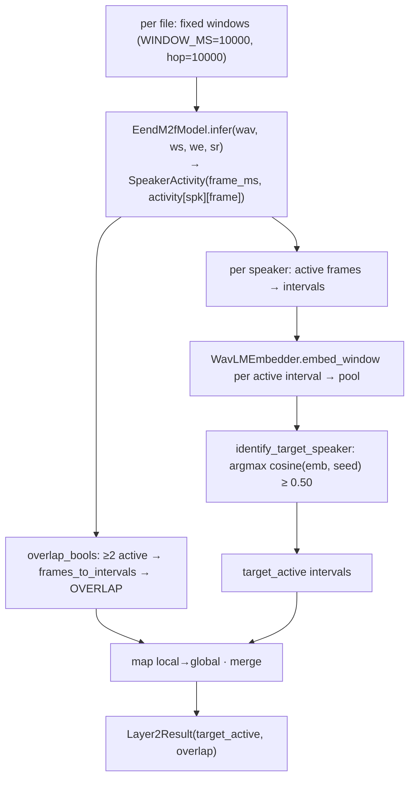
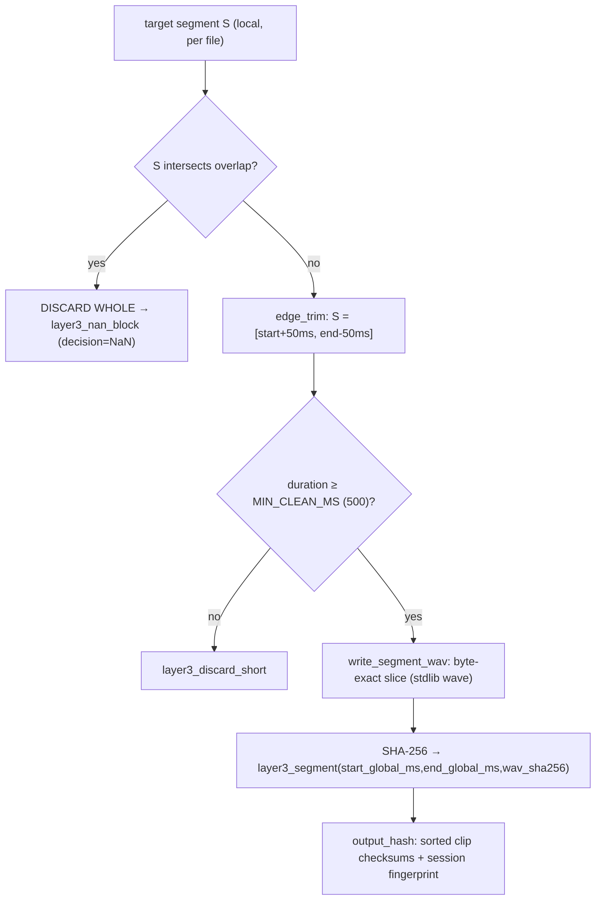
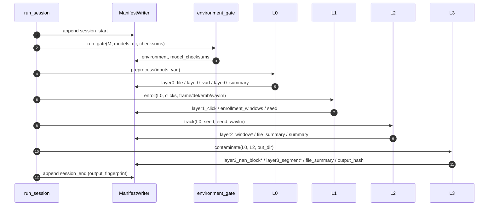
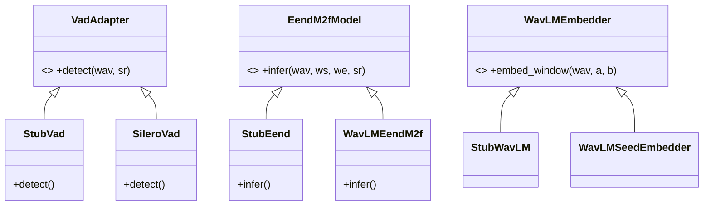
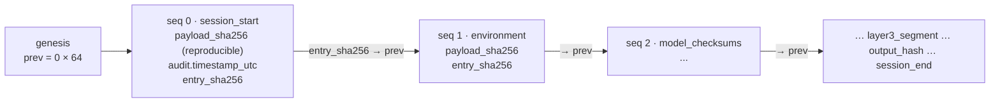

# WavLM + EEND‑M2F Forensic Diarization — Technical Deep Dive

**Audience:** audio‑research scientists and principal engineers studying this
pipeline in depth.
**Scope:** the *complete* theory and implementation of the diarizer built in
`WavLM+EEND M2F/` — `forensics/{pts,determinism,manifest}.py`,
`environment_gate.py`, `layer0_preprocessor.py`, `layer1_enrollment.py`,
`layer2_tracker.py`, `layer3_contamination.py`, `pipeline_runner.py`.

> **Naming.** The in‑house predecessor is referred to as **the legacy
> ECAPA‑TDNN + PyAnnote‑OVD pipeline**; its project codename is withheld.

> **Mission in one sentence.** Given a batch of interview clips from one
> continuous session and an operator's mouse click on the target's face, emit
> *only* the target's **uncontaminated** speech as integer‑PTS‑stamped `.wav`
> clips, with a tamper‑evident audit trail and bit‑exact reproducibility.

---

## Table of contents

1. [Theoretical foundation](#1-theoretical-foundation)
   - 1.1 [The diarization problem under a forensic constraint](#11-the-diarization-problem-under-a-forensic-constraint)
   - 1.2 [Why WavLM instead of ECAPA‑TDNN](#12-why-wavlm-instead-of-ecapa-tdnn)
   - 1.3 [EEND‑M2F: end‑to‑end neural diarization, mask‑transformer formulation](#13-eend-m2f-end-to-end-neural-diarization-mask-transformer-formulation)
2. [Pipeline architecture & step‑by‑step flow](#2-pipeline-architecture--step-by-step-flow)
   - 2.1 [Module map & execution order](#21-module-map--execution-order)
   - 2.2 [High‑level flow](#22-high-level-flow)
   - 2.3 [Data transformations, tensor by tensor](#23-data-transformations-tensor-by-tensor)
   - 2.4 [Environment Gate](#24-environment-gate)
   - 2.5 [Layer 0 — Preprocessor](#25-layer-0--preprocessor)
   - 2.6 [Layer 1 — Enrollment](#26-layer-1--enrollment)
   - 2.7 [Layer 2 — Tracking](#27-layer-2--tracking)
   - 2.8 [Layer 3 — Contamination](#28-layer-3--contamination)
   - 2.9 [The runner: one session, one chain](#29-the-runner-one-session-one-chain)
   - 2.10 [The Adapter‑Seam pattern](#210-the-adapter-seam-pattern)
3. [The forensic substrate](#3-the-forensic-substrate)
4. [Critical analysis: advantages, disadvantages, trade‑offs](#4-critical-analysis-advantages-disadvantages-trade-offs)
5. [References](#5-references)
6. [Appendix: manifest record catalog & parameters](#6-appendix-manifest-record-catalog--parameters)

---

## 1. Theoretical foundation

### 1.1 The diarization problem under a forensic constraint

Speaker diarization answers "who spoke when." Classically it is decomposed as:
**segmentation** (find speech) → **embedding** (characterise each segment's
speaker) → **clustering** (group segments by speaker). This decomposition has a
fatal structural assumption for our use case: **clustering produces a hard
partition** — every frame is assigned to exactly one speaker. Overlapping speech
(two people at once) cannot be represented; it is either silently mis‑assigned
or requires a *separate* overlapped‑speech detector bolted onto the side.

Our problem adds a **forensic constraint** that inverts normal priorities. We do
not want a complete, pretty diarization of everyone. We want, for **one** enrolled
target, audio segments that are provably *uncontaminated* — i.e. the target and
**only** the target is audible. Anywhere two voices coincide, the evidentiary
value is destroyed; we must **discard** it, never reconstruct it. So the two
acoustic capabilities we actually need are:

1. **Robust target representation** — a speaker profile that survives noise and
   partial degradation (→ §1.2, WavLM).
2. **Reliable overlap detection** — a first‑class, per‑frame signal of "≥2
   speakers active here" (→ §1.3, EEND‑M2F).

Everything else (separation, global multi‑speaker labelling) is not only
unnecessary — *emitting* it would violate the forensic mandate.

### 1.2 Why WavLM instead of ECAPA‑TDNN

**ECAPA‑TDNN** (Desplanques et al., 2020) is a *discriminative speaker‑embedding*
network: an SE‑Res2Net/TDNN backbone with multi‑layer feature aggregation and
**attentive statistics pooling** that collapses a variable‑length window into a
single fixed vector (typically 192‑d), trained with AAM‑softmax for speaker
verification. It is small, fast, and excellent at its job — *on clean,
single‑speaker windows*. Two properties make it a poor fit here:

- **It pools to one vector.** Attentive statistics pooling assumes the window
  contains *one* speaker and summarises "the speaker." Over an overlap region it
  produces a meaningless blend. It has no concept of "two speakers present."
- **It is a fixed‑window front‑end for a clustering pipeline.** You slide it,
  embed each window, then cluster — inheriting all the brittleness of clustering
  thresholds and the inability to model overlap.

**WavLM** (Chen et al., 2022) is a *self‑supervised* speech representation model
(HuBERT lineage). Two pretraining design choices make it categorically different:

- **Masked speech *denoising* + prediction.** During pretraining WavLM mixes
  utterances and adds noise — *simulating overlapped/noisy speech* — and trains
  the model to predict the pseudo‑labels of the **primary** speaker's clean
  speech from the contaminated input. The representation is therefore explicitly
  optimised to stay informative *under overlap and degradation* — exactly the
  regime forensic audio lives in.
- **Frame‑level contextual features with gated relative position bias.** WavLM
  emits a sequence of ~50 Hz (20 ms) contextual vectors (768‑d Base, 1024‑d
  Large) that carry phonetic, prosodic *and* speaker information at every frame —
  not a single pooled vector. This is precisely the input a neural diarizer (an
  EEND head) consumes.

**Why this is superior for *this* task:**

| Dimension | ECAPA‑TDNN | WavLM |
|---|---|---|
| Output granularity | 1 pooled vector / window | per‑frame (50 Hz) contextual sequence |
| Overlap behaviour | collapses to nonsense | trained to be overlap/noise‑robust |
| Role | front‑end for *clustering* | front‑end for *end‑to‑end* diarization |
| Degradation | sharp on clean, brittle on dirty | graceful under contamination |
| Generality | speaker‑verification only | "full‑stack" (SUPERB top tier incl. diarization) |

In this pipeline WavLM is used twice: as the **Layer‑1 seed** (mean‑pooled frame
features → an L2‑normalised target profile) and as the **Layer‑2 front‑end** that
feeds EEND‑M2F (and re‑identifies the target per window).

> **Honest caveat (revisited in §4).** "WavLM *instead of* ECAPA" is a slight
> false dichotomy for the *seed* specifically. The strongest speaker embeddings
> today are often an ECAPA/pooling head trained *on top of* WavLM features
> (WavLM‑ECAPA). Our pooled‑WavLM seed trades a little verification sharpness for
> overlap‑robustness and architectural simplicity; a learned WavLM→ECAPA head
> would be a strict upgrade to Layer 1's seed and is the obvious future change.

### 1.3 EEND‑M2F: end‑to‑end neural diarization, mask‑transformer formulation

**End‑to‑End Neural Diarization (EEND)** (Fujita et al., 2019) reframes
diarization as **per‑frame multi‑label classification**: for each frame, output
an independent activity probability for each speaker. Because the labels are
*not* mutually exclusive (sigmoid, not softmax), **overlap is native** — two
speakers can both be "active" at the same frame. There is no clustering step and
no hard partition. EEND‑EDA (Horiguchi et al., 2020) added *encoder‑decoder
attractors* to handle an unknown number of speakers.

**EEND‑M2F** brings the **Mask2Former** paradigm (Cheng et al., 2022 — masked‑
attention mask transformers, originally for image segmentation) to diarization.
The formulation:

- A set of **learnable queries** (the diarization analogue of object queries /
  attractors), each meant to bind to one speaker.
- A transformer decoder where each query does **masked cross‑attention** over the
  WavLM frame features: a query attends only to the frames it currently believes
  belong to its speaker, and this mask is **refined iteratively** across decoder
  layers (the "masked, multi‑step refinement").
- Each query emits a **per‑frame activity mask** (a 1‑D temporal mask). The dot
  product of query embeddings with frame features yields the masks.
- Training uses **set prediction with bipartite (Hungarian) matching** — the
  model predicts a fixed set of masks and is matched permutation‑invariantly to
  the ground‑truth speakers, sidestepping EEND's permutation problem and
  decoupling "how many speakers" (number of active queries) from "where each
  speaks" (the masks).

Diagrammatically, how this differs from clustering:



**How *we* use it (the forensic twist).** EEND‑M2F can both (a) tell us *where ≥2
speakers overlap* and (b) *separate/attribute* the overlapping voices. We exploit
(a) and **forbid** (b):

- **Overlap detection** is read off the masks **identity‑agnostically**: a frame
  is contaminated iff ≥2 masks are active there (`overlap_bools` in
  `layer2_tracker.py`). This is the contamination signal Layer 3 consumes.
- **Separation is never emitted.** We do not reconstruct or output a "cleaned"
  overlapped target. Any overlap → the enclosing segment is discarded whole
  (§3.1). We use the model's overlap‑*awareness* while refusing its
  separation‑*capability*.

We also avoid the classic EEND cross‑window **permutation problem** (query #2 in
window *k* ≠ query #2 in window *k+1*) without global clustering: since we only
care about one person, in each window we **re‑identify the target** by comparing
each query's WavLM embedding to the Layer‑1 seed (cosine). Overlap needs no
identity at all. This is a deliberate simplification that buys determinism and
robustness (§2.7, §4).

---

## 2. Pipeline architecture & step‑by‑step flow

### 2.1 Module map & execution order

Strict dependency order; **no module imports a later one**:

```
forensics/pts.py          integer-ms time, GlobalClock, interval algebra
forensics/determinism.py  seeds, deterministic algorithms, run-twice check
forensics/manifest.py     append-only SHA-256 hash-chained writer/verifier
environment_gate.py       offline + weight checksums + determinism → manifest
layer0_preprocessor.py    ffmpeg 16k mono + Silero VAD (VadAdapter)
layer1_enrollment.py      click→face→WavLM seed (FrameSource/FaceDetector/FaceEmbedder/WavLMEmbedder)
layer2_tracker.py         EEND-M2F target+overlap maps (EendM2fModel)
layer3_contamination.py   NaN-only discard + edge-trim + clean wavs
pipeline_runner.py        wires gate→L0→L1→L2→L3 on one ManifestWriter
```

### 2.2 High‑level flow



### 2.3 Data transformations, tensor by tensor



Concrete data structures (all integer‑ms; floats only at the model boundary):

- **`Layer0Result`** — `sr`, `files: List[Layer0File]` (`wav_path`, `wav_sha256`,
  `duration_ms`, `offset_ms`, …), `global_clock: GlobalClock`,
  `speech_by_file: {file_index: [(start_ms,end_ms)]}`, `speech_global`.
- **`Layer1Result`** — `target_embedding: List[float]`, `anti_embedding`,
  `enrollment_windows: [(file_index,start_ms,end_ms)]`, `seed: List[float]`.
- **`SpeakerActivity`** — `frame_ms: int`, `activity: List[List[int]]` (shape
  `[n_speakers][n_frames]`, values ∈ {0,1}).
- **`Layer2Result`** — `target_active`, `overlap` (global int‑ms), plus
  `target_by_file` / `overlap_by_file` (local).
- **`Layer3Result`** — `clean_segments: List[dict]`, `output_fingerprint: str`,
  `clean_ms`, `contaminated_ms`, `discarded_short`.

### 2.4 Environment Gate

`environment_gate.run_gate(writer, models_dir, checksums_path, seed, expected_models)`:

1. **`enforce_offline()`** sets `HF_HUB_OFFLINE=1`, `TRANSFORMERS_OFFLINE=1`,
   telemetry off — *before* any model library is imported.
2. **`enforce_determinism(seed)`** (from `forensics.determinism`) seeds
   python/numpy/torch(+CUDA), calls `torch.use_deterministic_algorithms(True)`
   (no `warn_only`), disables TF32 and the cuDNN autotuner, pins
   `CUBLAS_WORKSPACE_CONFIG=:4096:8`.
3. **`determinism_selfcheck(seed)`** runs a fixed tensor through a fixed op twice
   and compares SHA‑256 of the bytes; a `FAIL` raises `GateError` (the box can't
   guarantee bit‑exactness → abort).
4. **`verify_checksums()`** reads `models/checksums.json` and SHA‑256‑verifies
   every staged weight; any missing file or mismatch raises `GateError`.
5. Writes opening provenance records: `environment`, `model_checksums`.

### 2.5 Layer 0 — Preprocessor

For each clip in canonical order: `ensure_wav()` extracts 16 kHz mono PCM via
ffmpeg (pass‑through wavs must already be 16 kHz mono or it halts);
`wav_meta()` (stdlib `wave`) gives `(sr, channels, n_frames)`; `duration_ms =
samples_to_ms(n_frames, sr)`; the file is SHA‑256'd. The `VadAdapter` returns
speech as **sample‑index** pairs, converted to merged integer‑ms intervals
(`vad_samples_to_intervals_ms`). Per‑file offsets accumulate into a
`GlobalClock`, and each file's speech is projected onto the global clock. VAD
parameters are fixed and logged (`threshold 0.5`, `min_speech 250 ms`,
`min_silence 100 ms`, `speech_pad 30 ms`). Records: `layer0_file`, `layer0_vad`,
`layer0_summary`.

### 2.6 Layer 1 — Enrollment



The operator click **defines** the target by geometry (tightest enclosing box),
not by matching — visual anchoring is the trust root. `anti_click` (optional)
defines a face to exclude. The clean‑window proxy is **sole‑face** (a single
detected face that matches the target and not the anti) — conservative and fully
deterministic. Embedding checksums (`vector_sha256`, float64‑packed) and all
windows are logged (`layer1_click`, `layer1_enrollment_windows`, `layer1_seed`).

### 2.7 Layer 2 — Tracking



Per fixed window the adapter returns a `[n_speakers][n_frames]` 0/1 mask matrix
at its own `frame_ms`. **Overlap** is computed identity‑free (`≥2` masks). The
**target** is re‑identified *per window* by pooling each speaker's WavLM
embedding and taking the best cosine match to the seed (≥ `WAVLM_MATCH_THRESHOLD
= 0.50`), with deterministic tie‑breaking (lowest index) and a
`MIN_SPEAKER_ACTIVE_MS = 250` floor. Local intervals are mapped to the global
clock and merged. Records: `layer2_window` (incl. `target_cosine` rounded for
deterministic JSON), `layer2_file_summary`, `layer2_summary`.

### 2.8 Layer 3 — Contamination



`nan_partition` splits the target intervals by whether they intersect the overlap
map; **any intersection discards the whole segment** (NaN — never trimmed around
the overlap). Survivors are trimmed *inward* (`EDGE_TRIM_MS = 50`, strictly
conservative), dropped if too short, then written as byte‑exact slices of the
Layer‑0 wav and SHA‑256'd. The final `output_hash` carries every clip checksum
plus a single session fingerprint `SHA(canonical(sorted(output_shas)))`.

### 2.9 The runner: one session, one chain



`run_session` threads a **single** `ManifestWriter` through every layer via an
`Adapters` bundle, so the entire run is one continuous, verifiable hash chain.

### 2.10 The Adapter‑Seam pattern

Every model‑backed capability is reached through an **abstract adapter**.
Orchestration depends only on the abstract type; concrete implementations are
either heavy (real models, lazy/deps‑injected, Ubuntu‑only) or stubs (pure
Python, drive the stdlib self‑tests on the macOS dev box).



Why it matters:

- **Dev/deploy split.** Heavy imports are *inside* the real adapters, so the
  whole pipeline imports and self‑tests on plain Python 3.10 — zero pip installs,
  no torch, no GPU. Real execution happens only on the Ubuntu RTX 6000 Ada box.
- **Testability.** Stubs make every *decision* (window math, click geometry,
  overlap logic, NaN policy, manifest chain) deterministically testable without
  models — the integration self‑test runs gate→L0→L1→L2→L3 end‑to‑end on
  synthetic data.
- **Determinism isolation.** Non‑determinism is quarantined behind the seam; the
  surrounding logic is pure integer arithmetic.
- **Swappability.** Two deployment‑specific seams are *injected* callables —
  `eend_forward_fn` (the EEND‑M2F head) and `decode_fn` (PTS frame decode) — so
  the checkpoint/decoder can change without touching pipeline logic.

---

## 3. The forensic substrate

### 3.1 Uncontaminated target speech — the NaN‑only policy

The guarantee is enforced as a pure set operation in `layer3_contamination.py`:

```python
def nan_partition(target_segs, overlap):
    clean, nan = [], []
    for seg in merge(target_segs):
        if intersect([seg], overlap):   # touches ANY overlap frame
            nan.append(seg)             # → discarded WHOLE (no trimming, no separation)
        else:
            clean.append(seg)
    return clean, nan
```

EEND‑M2F's separation capability is **never called** for output. Overlap is
computed identity‑agnostically in Layer 2 (`≥2` active masks); a target segment
that intersects it is logged as `layer3_nan_block` (`decision: "NaN"`) and
dropped entirely. Survivors are additionally trimmed *inward* by `EDGE_TRIM_MS`
— a strictly conservative operation (removes audio, never adds) that can only
strengthen the guarantee.

### 3.2 Offline / air‑gapped verification

`enforce_offline()` exports `HF_HUB_OFFLINE=1` / `TRANSFORMERS_OFFLINE=1` *before*
any model library import, so no code can reach the network. `verify_checksums()`
re‑hashes every staged weight and compares to `models/checksums.json`; the run
**halts** (`GateError`) on any mismatch or missing file. Verifying by our own
SHA‑256 (not the hub cache) is what makes "pre‑staged + offline" auditable.

### 3.3 Bit‑exact determinism

Layered defences, all in `forensics/determinism.py` + the gate:

- `seed_all(seed)` → python `random`, numpy, torch (+CUDA), `PYTHONHASHSEED`.
- `torch.use_deterministic_algorithms(True)` **without `warn_only`** — a
  nondeterministic CUDA kernel **raises** rather than silently drifting (a
  forensic system must fail loudly).
- TF32 off, `cudnn.deterministic = True`, `benchmark = False`,
  `CUBLAS_WORKSPACE_CONFIG=:4096:8`.
- **Fixed tensor shapes** (fixed Layer‑2 windows) and **integer‑ms** arithmetic
  everywhere (no float‑seconds drift).
- A **run‑twice self‑check** at the gate, plus Layer 3's reproducible
  `output_fingerprint` (asserted identical across runs in the self‑test).

### 3.4 Append‑only, hash‑chained manifest (chain of custody)

`forensics/manifest.py` writes one canonical‑JSON object per line. Each record:

```text
payload_sha256 = SHA256( canonical(payload) )                          # CONTENT integrity
entry_sha256   = SHA256( prev_sha256 + payload_sha256
                         + str(seq) + operation + canonical(audit) )    # CUSTODY (binds time)
prev_sha256(next) = entry_sha256(this)                                  # the chain link
```



The two‑hash split is deliberate: **`payload_sha256` hashes only the payload**,
so content is **bit‑reproducible** across runs (you can prove run *N* equals run
*M*); the wall‑clock **`audit.timestamp_utc`** (ISO‑8601, **millisecond**
precision: `now.strftime("%Y-%m-%dT%H:%M:%S.") + f"{now.microsecond//1000:03d}Z"`)
is folded into **`entry_sha256`**, so the *chain* captures the real‑world time of
execution. `verify_chain()` re‑walks and recomputes both hashes — tampering with
content **or** a recorded timestamp **or** record order breaks verification. The
manifest is written before destructive ops, single‑writer, append‑only, with
`fsync` durability. Layer‑2/3 worker records are double‑nested
(`{file_index, start_ms, operation, payload}`) so per‑file provenance travels
with each record.

---

## 4. Critical analysis: advantages, disadvantages, trade‑offs

A brutally honest appraisal versus the legacy **ECAPA‑TDNN + PyAnnote‑OVD**
approach (sliding‑window embeddings → clustering, with a separate overlapped‑
speech detector).

### 4.1 Where this pipeline wins

- **Overlap is first‑class, not bolted on.** EEND‑M2F predicts per‑speaker masks;
  "≥2 active" is a direct output. The legacy stack needs a *separate* OVD model
  whose calibration is independent of the diarizer, and clustering itself cannot
  represent overlap at all. For a pipeline whose entire purpose is *detecting
  contamination*, having overlap as a native signal is the right architecture.
- **WavLM features are overlap/noise‑robust by construction** (denoising
  pretraining), degrading gracefully exactly where forensic audio is hardest.
- **End‑to‑end learning replaces brittle clustering knobs.** No AHC distance
  threshold, no spectral‑clustering eigengap heuristics, no segment‑length vs
  purity trade‑off to hand‑tune per session.
- **Per‑window seed re‑ID sidesteps the global permutation/clustering problem.**
  We never have to solve "which cluster is the target across the whole session";
  we re‑anchor to the seed in each window. Deterministic and robust to query
  churn.
- **Forensic NaN policy is precise** because it reads a per‑frame overlap signal
  rather than inferring contamination from clustering ambiguity.

### 4.2 Where it struggles or can fail

- **No canonical off‑the‑shelf checkpoint.** PyAnnote 3.x and ECAPA are mature,
  packaged, and benchmarked. EEND‑M2F here is reached through an adapter whose
  real `forward_fn`/checkpoint the operator must supply and validate — **the
  acoustic accuracy is unproven until that runs on real audio.** This is the
  single biggest risk; the plumbing/forensics are tested, the diarization quality
  is not.
- **Overlap‑threshold calibration directly controls the discard rate.** Reading
  "active" off EEND masks depends on a binarisation threshold. Too sensitive →
  **over‑discard** (lose good target speech; safe but wasteful). Too lax →
  **leak contamination** (forensically unacceptable). A dedicated, separately‑
  calibrated OVD (the legacy's PyAnnote‑OVD) is arguably *more trustworthy for the
  specific job of overlap detection* than a threshold on diarization masks.
- **Compute & memory.** WavLM Large (~316 M params) + a transformer diarization
  head is heavy (VRAM, latency) versus ECAPA (small) + lightweight clustering.
  Justified by the RTX 6000 Ada, but it is a real cost.
- **Determinism is harder.** Large transformers on CUDA have nondeterministic
  kernels; `use_deterministic_algorithms(True)` may *raise* (by design) or force
  slow fallbacks. A small ECAPA pipeline is far easier to make bit‑exact. We
  accept hard failures over silent drift, but this *will* surface on the GPU box.
- **Window‑boundary effects.** Non‑overlapping fixed windows lose cross‑window
  context (EEND benefits from context); a speaker turn straddling a boundary can
  be split, and per‑window re‑ID can disagree at seams. Overlapping windows +
  merge would help at the cost of determinism complexity.
- **The pooled‑WavLM seed is weaker than a dedicated verifier** (§1.2 caveat). A
  marginal target/interviewer voice similarity can flip the per‑window re‑ID; a
  WavLM‑ECAPA head would be more discriminative.
- **EEND family weaknesses persist.** Many simultaneous speakers, very long
  sessions, and unknown speaker counts are historically hard for EEND; set
  prediction can miss or hallucinate a speaker, which perturbs both target
  attribution and overlap counts.
- **Enrollment proxy is crude.** Sole‑face ≠ acoustically clean; the seed could
  be built from visually‑clean‑but‑acoustically‑overlapped audio. (Output is
  still protected by L2/L3, but a contaminated *seed* can mis‑identify the
  target.)
- **Edge‑trim is blunt.** A fixed ±50 ms inward trim is coarser than the legacy's
  finer boundary‑refinement; it can clip a few ms of genuine target speech.

### 4.3 Head‑to‑head

| Criterion | Legacy ECAPA‑TDNN + PyAnnote‑OVD | This: WavLM + EEND‑M2F |
|---|---|---|
| Overlap modelling | clustering can't; separate OVD bolt‑on | native per‑speaker masks |
| Front‑end | discriminative pooled embedding | SSL frame features (overlap‑robust) |
| Speaker count | clustering must estimate it | set prediction / per‑window re‑ID |
| Hyper‑parameter brittleness | high (clustering thresholds) | lower (learned), but mask threshold matters |
| Off‑the‑shelf maturity | **high** | **low** (custom checkpoint) |
| Overlap‑detector trust | dedicated, calibrated OVD | threshold on diarization masks |
| Compute / VRAM | light | heavy |
| Determinism difficulty | easier | harder (large transformer on CUDA) |
| Seed/verifier sharpness | ECAPA is strong | pooled WavLM weaker (WavLM‑ECAPA would fix) |
| Fit to *forensic contamination* goal | indirect | **direct** |

### 4.4 The trade‑off of choosing EEND‑M2F

We traded **maturity, calibration certainty, light compute, and easy
determinism** (the legacy stack's strengths) for **native overlap modelling, an
overlap‑robust front‑end, fewer brittle clustering knobs, and an architecture
whose primary output is exactly the contamination signal the forensic mission
needs.** That is the right bet *if and only if* the EEND‑M2F checkpoint is
trained/validated on representative interview audio and its overlap binarisation
is calibrated conservatively. Until that validation exists, the legacy stack
remains the safer *known quantity* — which is precisely why the `sota_sandbox/`
A/B harness exists: to measure this new pipeline's real diarization output
against a SOTA baseline before trusting it.

### 4.5 Recommendation

- **Now:** treat the EEND‑M2F path as experimental; validate overlap‑detection
  recall (forensically, missing overlap is the dangerous error) on labelled
  interview data; calibrate the mask threshold toward **over‑discard**.
- **Next:** replace the pooled‑WavLM seed with a WavLM‑ECAPA verifier head;
  consider overlapping Layer‑2 windows with deterministic merge; replace the
  sole‑face enrollment proxy with an acoustic‑purity check.

---

## 5. References

- Chen et al., 2022 — *WavLM: Large‑Scale Self‑Supervised Pre‑Training for Full
  Stack Speech Processing.* (masked speech denoising + prediction; gated relative
  position bias; SUPERB.)
- Desplanques et al., 2020 — *ECAPA‑TDNN: Emphasized Channel Attention,
  Propagation and Aggregation in TDNN‑Based Speaker Verification.*
- Fujita et al., 2019 — *End‑to‑End Neural Speaker Diarization with
  Permutation‑Free / Self‑Attention.*
- Horiguchi et al., 2020 — *End‑to‑End Speaker Diarization for an Unknown Number
  of Speakers with Encoder‑Decoder Based Attractors (EEND‑EDA).*
- Cheng et al., 2022 — *Masked‑attention Mask Transformer for Universal Image
  Segmentation (Mask2Former).* (the "M2F" paradigm adapted here to diarization.)
- Bredin et al. — *pyannote.audio* speaker diarization & overlapped‑speech
  detection (the legacy baseline family).

*(EEND‑M2F is the application of the Mask2Former masked‑attention mask‑transformer
formulation to end‑to‑end diarization; the exact head/checkpoint used in
deployment is supplied via the `EendM2fModel` adapter.)*

---

## 6. Appendix: manifest record catalog & parameters

**Record operations (in execution order):**

| `operation` | Emitted by | Key payload fields |
|---|---|---|
| `session_start` | runner | `seed`, `n_inputs`, `inputs`, `sample_rate` |
| `environment` | gate | `offline_env`, `determinism`, `determinism_selfcheck` |
| `model_checksums` | gate | `models: [{name, sha256}]` |
| `layer0_file` | L0 | `wav_path`, `wav_sha256`, `duration_ms`, `offset_ms`, `sample_rate` |
| `layer0_vad` | L0 | `params`, `n_segments`, `speech_ms`, `segments_ms` |
| `layer0_summary` | L0 | `n_files`, `session_ms`, `speech_ms` |
| `layer1_click` | L1 | `target_box`, `target_emb_sha256`, `anti_present`, `face_match_threshold` |
| `layer1_enrollment_windows` | L1 | `n_windows`, `total_ms`, `windows_global_ms`, `seed_min_ms` |
| `layer1_seed` | L1 | `dim`, `seed_sha256`, `total_enroll_ms` |
| `layer1_failure` | L1 | `reason` (guardrail halt) |
| `layer2_window` | L2 | `window_ms`, `frame_ms`, `n_speakers`, `target_speaker_idx`, `target_cosine`, `overlap_ms` |
| `layer2_file_summary` / `layer2_summary` | L2 | `target_ms`, `overlap_ms` |
| `layer3_nan_block` | L3 | `decision="NaN"`, `start_global_ms`, `end_global_ms` |
| `layer3_segment` | L3 | `decision="CLEAN"`, `start_global_ms`, `end_global_ms`, `wav_sha256` |
| `layer3_discard_short` | L3 | `reason`, `trimmed_ms` |
| `layer3_file_summary` | L3 | `n_clean`, `n_nan`, `n_short`, `clean_ms`, `contaminated_ms` |
| `output_hash` | L3 | `output_sha256s`, `output_fingerprint` |
| `session_end` | runner | `output_fingerprint`, `n_outputs`, `clean_ms` |

**Fixed parameters (all manifest‑logged):**

| Constant | Value | Module |
|---|---|---|
| `TARGET_SR` | 16000 | layer0 |
| VAD `threshold / min_speech / min_silence / speech_pad` | 0.5 / 250 / 100 / 30 ms | layer0 |
| `FACE_MATCH_THRESHOLD` | 0.40 | layer1 |
| `ENROLL_SAMPLE_MS` | 250 | layer1 |
| `SEED_MIN_MS` | 3000 | layer1 |
| `WINDOW_MS` / `HOP_MS` | 10000 / 10000 | layer2 |
| `WAVLM_MATCH_THRESHOLD` | 0.50 | layer2 |
| `MIN_SPEAKER_ACTIVE_MS` | 250 | layer2 |
| `EDGE_TRIM_MS` | 50 | layer3 |
| `MIN_CLEAN_MS` | 500 | layer3 |
| `CUBLAS_WORKSPACE_CONFIG` | `:4096:8` | determinism |
| manifest schema | `forensic-manifest-v1` | manifest |

*End of technical deep dive.*
